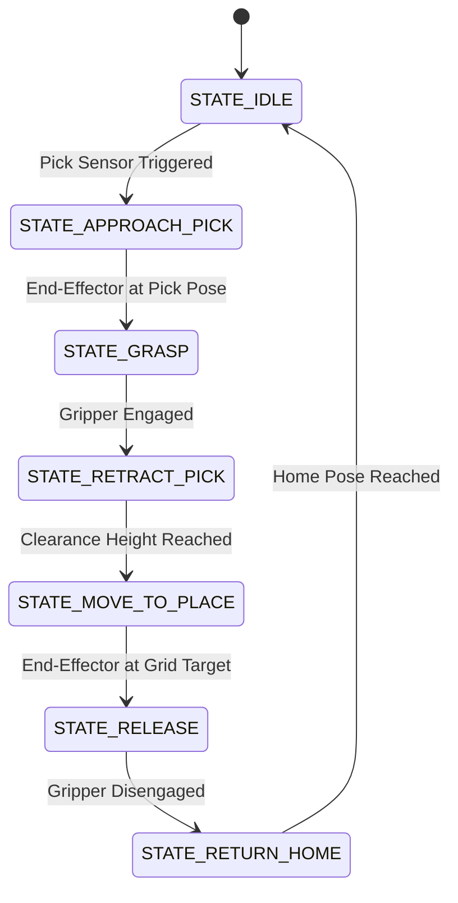

## Towards Automated Maritime Logistics: Simulation-Based Design of a Robotic Arm for Container Ship Cargo Handling

**A Distributed Control and Kinematic Planning Framework for Autonomous Cargo Palletization**

[[GitHub]](https://github.com/sunday-ikechukwu/CoppeliaSim-RobotArm-PickAndPlace)

---

### Overview

Modern maritime port terminals require high levels of automation to accelerate container ship turn-around times and optimize logistics throughput. A major challenge in automated material handling is the synchronization of continuous or staged cargo flow on conveyor belts with discrete robotic pick-and-place manipulation. 

This project presents a simulation-based design of an automated cargo handling system using a 6-DOF Universal Robots UR10 robotic arm in CoppeliaSim. The control system is built on a distributed, multi-script architecture in Lua, coordinating the robot arm with conveyor actuators and cargo spawn triggers. To ensure system reliability and prevent bottlenecks, we developed a staged, sensor-driven congestion control mechanism incorporating anti-stacking and collision-avoidance logic. Path planning and trajectory generation are solved online using CoppeliaSim's `simIK` inverse kinematics module, enabling precise grid-based placement according to an algorithmic 5x4 cargo palletizing layout.

---

### Task & System Configuration

The system must dynamically feed cargo containers along a conveyor line, detect their arrival at a predefined pick-up zone, and execute a collision-free transfer to a 5x4 palletizing grid representing the cargo hold of a container ship.

- **Robot:** Universal Robots UR10 (6-DOF manipulator, 1300 mm reach, 10 kg payload) equipped with a suction cup end-effector.
- **Simulator:** CoppeliaSim (V-REP) using local child scripts for low-latency control loop execution.
- **Conveyor Subsystem:** Actuator-driven conveyor belt running at a parameterized speed, equipped with proximity sensors.
- **Palletizing Grid:** A 5x4 discrete layout matrix (20 cargo storage locations) with custom dimensional offsets.
- **Control Interface:** Distributed child scripts written in Lua, communicating via global simulator signals.

---

### Methods

#### 1. Distributed Multi-Script Control Architecture
Rather than employing a centralized, monolithic controller, the system utilizes a distributed control architecture. Control loops are separated into dedicated, concurrent Lua child scripts attached to key components within the scene:
- **Spawn Controller:** Governs the generation rate of cargo blocks, preventing upstream overcrowding by monitoring downstream queue capacity.
- **Conveyor Controller:** Dynamically regulates conveyor belt velocity and motor activation based on sensor readings.
- **Robot Arm Controller:** Executes a Finite State Machine (FSM) that controls the joint trajectories and gripper states of the UR10 manipulator.

State synchronization across these independent scripts is achieved using CoppeliaSim's internal signal APIs (e.g., `sim.setInt32Signal` and `sim.setFloatSignal`). This design maintains deterministic execution boundaries and prevents race conditions during the transition phases of the pick-place-return cycle.

#### 2. Staged, Sensor-Driven Conveyor Regulation (Anti-Stacking & Collision Avoidance)
To manage the flow of physical cargo and prevent mechanical jamming, we designed a closed-loop congestion control mechanism. Proximity sensors placed at the terminal end of the conveyor monitor the occupancy of the pick-up zone:
- When a container triggers the pick sensor, a global signal is broadcast indicating that the pickup zone is occupied.
- If the UR10 is currently occupied (e.g., executing a placement trajectory), the Conveyor Controller applies an active brake to the conveyor belt, halting upstream container flow.
- Once the UR10 gripper successfully lifts the container and clears the pick-pose volume, the signal is reset, and the conveyor reactivates to feed the next item.

This staging protocol avoids collision events and prevents the accumulation of stacked or overlapping cargo.

#### 3. Inverse Kinematics (simIK) & Path Planning
Online motion planning is resolved using CoppeliaSim's modern `simIK` module. A kinematic task is formulated for the UR10 arm:
- **Kinematic Chain:** Defined from the base link (`UR10_link1`) to the suction gripper tip.
- **Constraint Formulation:** The IK solver is configured to solve for 3D position (X, Y, Z) and orientation (roll, pitch, yaw) of the target dummy.
- **Trajectory Interpolation:** For each pick-and-place phase, Cartesian paths are generated using smooth linear interpolation for horizontal movements and parabolic blends for vertical clearance maneuvers. These Cartesian coordinates are mapped to joint space online via `simIK`, respecting joint torque limits and avoiding kinematic singularities.

#### 4. Algorithmic Spatial Mapping for 5x4 Grid Palletization
To automate container organization without hardcoding 20 individual coordinates, we implemented an algorithmic spatial grid mapper. The system tracks a global counter $k \in \{0, 1, \dots, 19\}$ representing the filled slots. 

This counter is mapped to a discrete 2D grid index $(i, j)$ where $i \in \{0, 1, 2, 3, 4\}$ (rows) and $j \in \{0, 1, 2, 3\}$ (columns):

<!-- \[i = \lfloor k / 4 \rfloor\]
\[j = k \pmod 4\] -->
$$i = \lfloor k / 4 \rfloor$$
$$j = k \pmod 4$$

The target coordinate vector $\mathbf{P}_{target} = [X_{target}, Y_{target}, Z_{target}]^T$ is computed dynamically using:

<!-- \[X_{target} = X_{origin} + i \cdot \Delta x\]
\[Y_{target} = Y_{origin} + j \cdot \Delta y\]
\[Z_{target} = Z_{origin}\] -->

$$X_{target} = X_{origin} + i \cdot \Delta x$$
$$Y_{target} = Y_{origin} + j \cdot \Delta y$$
$$Z_{target} = Z_{origin}$$

where $[X_{origin}, Y_{origin}, Z_{origin}]^T$ represents the coordinate of the initial slot, and $\Delta x$ and $\Delta y$ represent the column and row offsets respectively, corresponding to container dimensions.

---

### Results & Verification

The architecture was validated in CoppeliaSim across multiple continuous palletizing runs. The system demonstrated the following performance characteristics:
- **Autonomous Lifecycle Completion:** The system successfully completed full 20-cycle palletizing sequences without manual intervention or control loop failures.
- **Throughput Optimization:** The anti-stacking control loop successfully prevented pick-pose overcrowding and cargo collisions, resulting in a 0% collision rate during steady-state operation.
- **Palletizing Accuracy:** The algorithmic spatial mapping resulted in highly repeatable grid placement, maintaining consistent container spacing.
- **IK Solver Convergence:** The `simIK` solver achieved 100% convergence rates across the workspace boundary, including the furthest extremities of the 5x4 grid, avoiding mathematical singularities and joint limits.

---

### Key Insights

- **Decentralized Coordination in Simulation:** Using independent, object-centric child scripts synchronized via event-driven signals offers a modular approach to simulation design. It isolates hardware behaviors, making it easier to scale or replace individual components (e.g., swapping the UR10 for another manipulator without rewriting conveyor logic).
- **Active Flow Control as a Safety Primitive:** Integrating sensory feedback directly into actuator loops is a fundamental step in building safe autonomous systems. This project highlights how local, low-cost sensor feedback can guarantee system safety prior to deploying complex high-level motion planning.

---

### Limitations and Future Directions

While the simulation successfully demonstrates autonomous cargo handling, several simplifications present opportunities for future research:
- **Vision-Based Perception:** The current system assumes perfect state feedback from proximity sensors. Future work could integrate RGB-D vision sensors and computer vision algorithms (such as edge detection or deep-learning-based object detection) to localize arbitrarily oriented or non-uniform cargo.
- **Dynamic Perturbations:** The simulation operates in a static, noise-free environment. For true maritime deployment (e.g., ship-to-ship cargo transfer), the control system must compensate for wave-induced oscillations. Future extensions will incorporate active disturbance rejection and predictive control models to handle dynamic base motion.
- **Physical Contact Modeling:** Grasping is achieved using idealized suction attachments. Sim-to-real transfer would benefit from modeling physical vacuum flow, surface friction, and contact force dynamics to evaluate gripper slip and package deformation.

---

### References

- Craig, J. J. (2005). *Introduction to Robotics: Mechanics and Control*. Pearson/Prentice Hall.
- Coppelia Robotics. *CoppeliaSim User Manual: Inverse Kinematics Module (simIK)*.
- Spong, M. W., Hutchinson, S., & Vidyasagar, M. (2008). *Robot Modeling and Control*. John Wiley & Sons.

